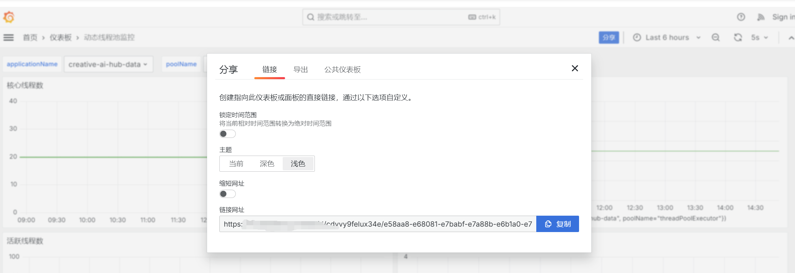

## 动态线程池组件
> 注：默认已经安装有了 Grafana 和 Prometheus 。
> 前端地址：https://gitee.com/Herbert0501/dynamic-thread-pool-web
### 1. 配置

#### 更改 [grafana.ini](./docs/dev-ops/grafana.ini) 配置文件内容。
```ini
[auth.anonymous]
enabled=true # 允许匿名访问
org_name=dynamic-thread-pool-guest # 默认为 dynamic-thread-pool-guest
org_role=Viewer # 默认为 Viewer
hide_version=true # 隐藏版本信息
[security]
allow_embedding = true # 允许嵌入
```
#### 更改 [prometheus.yml](./docs/dev-ops/prometheus.yml) 配置文件内容。
```yaml
scrape_configs:
  # 替换为你的应用名称
  - job_name: 'spring_boot_application'
    metrics_path: '/actuator/prometheus'
    static_configs:
      # 替换为你的应用地址
      - targets: ['192.168.192.160:8095']
```
#### 更改 [docker-compose.yml](./docs/dev-ops/docker-compose.yml) 配置文件内容。
要获取grafanaUrl，则先导入 [dynamic-thread-pool-grafana-dashboard.json](./docs/dev-ops/动态线程池监控-dashboard.json) 到 Grafana。
然后获取 grafanaUrl，可以取消勾选锁定区间。


### 未来计划

- [ ] 实现多种通知，并更精细的通知启用/关闭策略。
- [ ] 提供前端来操作通知启用和关闭，并且可以查看通知状态。
- [ ] 提供前端来调整线程池的上报时间。
- [ ] 提供可调整的通知频率（如 每 8 小时内，可连续通知 3 次，每次间隔 n 分钟）。
- [ ] 实现线程池自动调整策略。

#### 自动调整策略目录计划
```ini
|-- adjuster
|   |-- IThreadPoolAdjuster.java
|   |-- ThreadPoolAdjusterFactory.java
|   `-- strategy
|       |-- TaskQueueAdjuster.java
|       |-- CPUUsageAdjuster.java
|       `-- ResponseTimeAdjuster.java
```